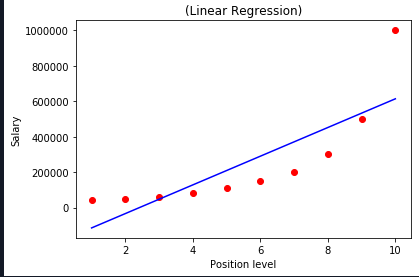
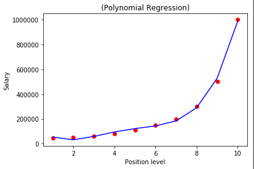
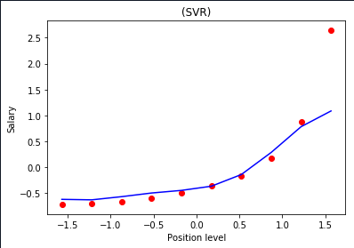
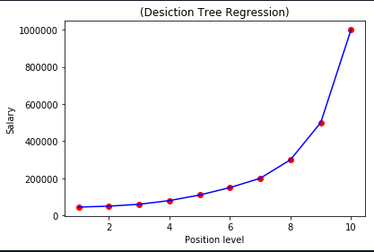
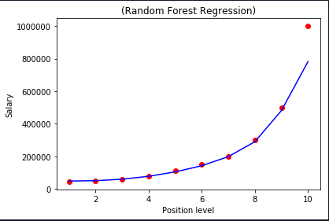

# Comparing-Regression-Models

Using a simple Dataset, different Regression models are compared and visualized.

### Required dependencies: 

`pip install -r requirements.txt`

**The dataset used is Position_Salaries.csv**

The Regression models used are:
1. Linear regression
2. Polynomial Regression
3. Support Vector Regression
4. Decision Tree Regression
5. Random Forrest Regression

The Comparison metrics used is R squared 

Linear_Regression : -8.925562842371185

 Polynomial_Regression: 0.9797446057401972

 Support_vector_Regression: 0.7591051547452287

 Decision_tree_Regression: 0.8718958207147183

 Random_forest_Regression: 0.958249987381385

**The test set contains the levels {3.5,5.5,6.5} and the Rsquare value is calculated.**

